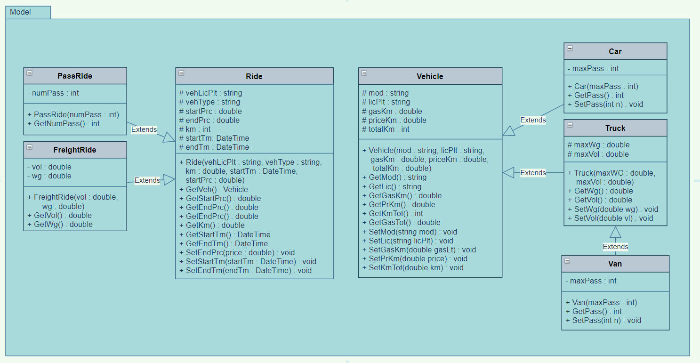
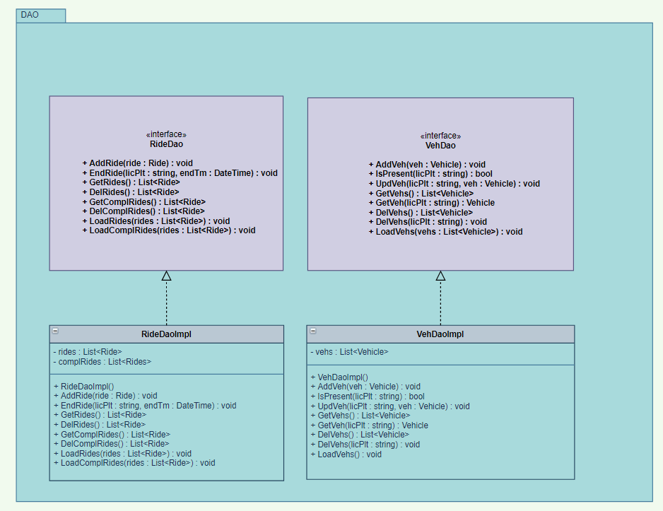
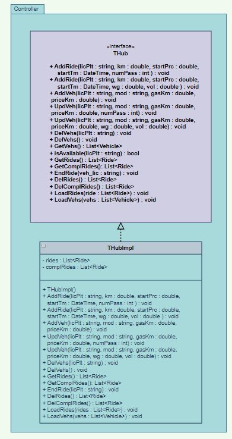

# Transportation Hub

## Introduction

The transportation hub is a useful tool to track both vehicles and rides. It is the central communication point for the user and it allows to:

- add, modify, and delete vehicles
- register new rides and finish them
- import and export vehicles and completed rides

## Class diagram

- ### Model

- ### DAO

- ### Controller

## Tools and Frameworks

- Visual Studio 2019 Community
- .NET Core 3.1

